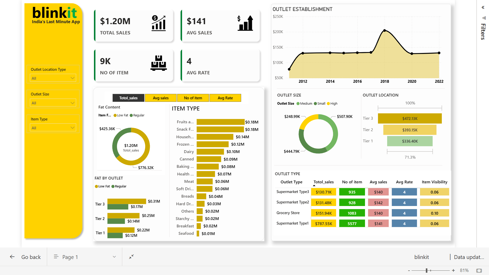

# BlinkIT Grocery Sales Performance - Power BI Dashboard 🛒📊

## Project Overview
This project provides a comprehensive analysis of BlinkIT's grocery sales data using Power BI. The dashboard tracks key performance indicators (KPIs) such as total sales, average customer ratings, and item visibility across different outlet types and locations. The goal is to uncover actionable insights that can help optimize inventory distribution and improve sales strategies.

## Dashboard Preview



## Dataset Description
The analysis is based on the `BlinkIT Grocery Data.csv` file, which contains detailed transactional and item-level data. Key columns include:
* **Item Attributes:** `Item Identifier`, `Item Type` (e.g., Dairy, Soft Drinks, Snack Foods), `Item Fat Content`, `Item Weight`, and `Item Visibility`.
* **Outlet Attributes:** `Outlet Identifier`, `Outlet Establishment Year`, `Outlet Size` (Small, Medium, High), `Outlet Location Type` (Tier 1, Tier 2, Tier 3), and `Outlet Type` (Supermarket, Grocery Store).
* **Metrics:** `Sales` and customer `Rating`.

## Key Insights & Business Questions Answered
The dashboard provides visual answers to the following business questions:
1. **Revenue Generation:** Which item types (e.g., Fruits & Vegetables vs. Snack Foods) generate the highest overall sales?
2. **Outlet Performance:** How do Tier 1, Tier 2, and Tier 3 locations compare in terms of total revenue and average customer ratings?
3. **Store Size Impact:** Does outlet size (Small vs. Medium vs. High) significantly influence sales volume?
4. **Fat Content Preference:** Is there a consumer preference for Low Fat versus Regular grocery items?
5. **Visibility vs. Sales:** Does higher item visibility in the store correlate with better sales and ratings?

## Tools & Technologies Used
* **Power BI:** For data visualization, building interactive dashboards, and calculating DAX measures.
* **Excel / CSV:** For initial data review and staging.

## How to Interact with the Project
1. Clone this repository to your local machine:
   ```bash
   git clone [https://github.com/yourusername/BlinkIT-Grocery-Sales-Analysis.git](https://github.com/yourusername/BlinkIT-Grocery-Sales-Analysis.git)
